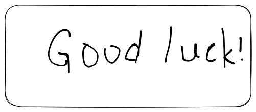

# 💻 CS lingo

## some lingos

* **DVCS**: distributed version control system.
* **NSFW:** not safe for work.

## headline 1st

### headline 2nd

headline 3rd

there is a paragraph.

```python
// some codes
print("hello world")
```

> quote test.

***


hint.


emebd a link as below.



***

shortcuts like `ctrl + c` & `ctrl + v` .

<details>

<summary>there is an expandable block.</summary>

Hi, there\~

</details>



insert emoji like :thumbsup:.&#x20;
